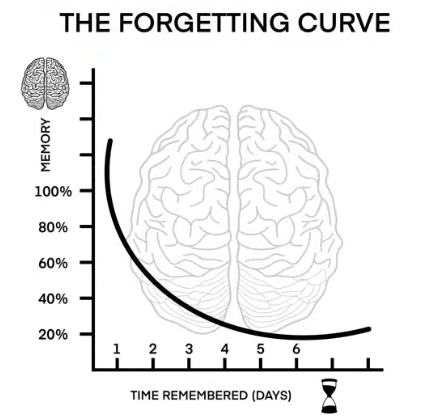

# Open Class 02 - Study Smarter, Not Harder (05/12/2026)

## 2º pilar: Memorização Inteligente

**Repetição Espaçada** é um sistema de revisão que consiste em rever o mesmo conteúdo várias vezes, mas com intervalos de tempo crescentes entre as revisões. O objetivo dessa técnica é achatar a "Cuva do Esquecimento" ou "*Forgetting Curve*".

### *Forgetting Curve*/Curva do Esquecimento

Um psicólogo alemão chamado *Hermann Ebbinghaus* estudou a memória e percebeu que: o cérebro **esquece rápido o que não é revisitado**, além disso, a **maior perda acontece nas primeiras horas**. Isso ficou conhecido como *"Forgetting Curve"* ou "Curva do Esquecimento".

Esquecemos muito rápido o que não é revisitado e grande parte do conteúdo se perde especialmente nas primeiras 24h. A sacada genial que foi pensada é que a cada revisão, a curva do esquecimento é "achatada", fazendo com que a memória possa durar mais.

Dessa forma, com a revisão espaçada, a memória é fortalecida e o processo de esquecimento torna-se mais lento. Ademais, com a repetição espaçada, o mesmo conteúdo é revisado várias vezes, mas com intervalos de tempo entre as revisões. Por exemplo:

Hoje &rarr; amanhã &rarr; daqui a alguns dias &rarr; depois de uma semana.

**Não tudo no mesmo dia!** Diferente de repetir mecanicamente várias vezes seguidas, o método foca em garantir que o vocabulário e estruturas gramaticais se tornem naturais e automáticos para o seu uso na fala, por meio da revisão em dias diferentes, utilização em contextos novos, como também ouvir, falar e ver diversas vezes; assim, exigindo menos esforço com o passar do tempo. Como resultado da aplicação dessa técnica há:

- Menos esquecimento;
- Mais retenção;
- Mais naturalidade.

Essa estratégia funciona tão bem com idiomas, porque:
- Vocabulário precisa virar ativo;
- Gramática precisa se tornar automática;
- Falar exige um acesso rápido à memória;
- **Não** é decorar, é **automatizar**.

## Vocabulary

Foreign &rarr; Estrangeiro/Estrangeira.

I get by &rarr; Eu me viro.

Cultural affairs &rarr; Asssuntos culturais/Relações culturais.

Spill the beans &rarr; Conte tudo/Desembucha.

Beat around the bush &rarr; Fazer rodeios/Enrolar.

### Examples

- *She speaks 2 foreign languages* (Ela fala 2 línguas estrangeiras).

- *Come on, spill the beans! Everyone already knows you're planning a big surprise* (Vamos lá, Desembucha! Todo mundo já sabe que você está planejando uma grande surpresa).

- *My English isn't perfect, but I get by when I travel abroad* (Meu Inglês não é perfeito, mas eu me viro quando viajo para o exterior).

- *She works in cultural affairs, organizing events that promote exchange between countries* (Ela trabalha com relações culturais, organizando eventos que promovem intercâmbio entre países).

- *Stop beating around the bush and tell me what really happened* (Pare de enrolar e me diga o que realmente aconteceu).